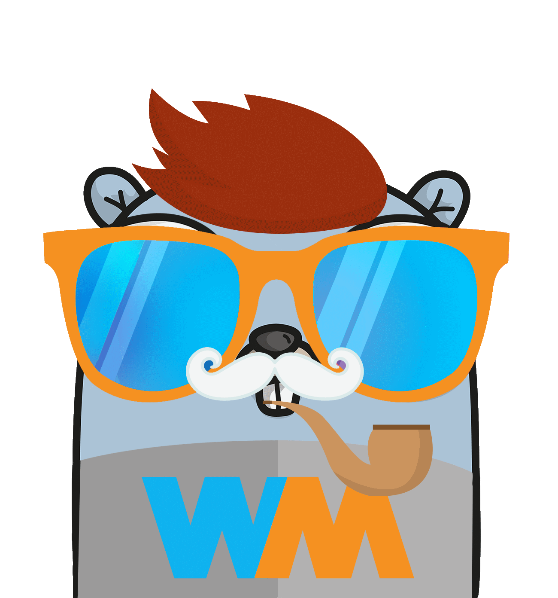

# go-wiremock

[](http://godoc.org/github.com/wiremock/go-wiremock)
[](https://github.com/wiremock/go-wiremock/actions?query=workflow%3Abuild)
[](https://goreportcard.com/report/github.com/wiremock/go-wiremock)

<a href="https://go.wiremock.org" target="_blank">
    
</a>

The Golang client library to stub API resources in [WireMock](https://wiremock.org) using its
[REST API](https://wiremock.org/docs/api/).
The project connects to the instance and allows
setting up stubs and response templating,
or using administrative API to extract observability data.

## Documentation

[](http://godoc.org/github.com/wiremock/go-wiremock)

## Compatibility

The library was tested with the following distributions
of WireMock:

- WireMock 2.x - standalone deployments, including but not limited to official Docker images, Helm charts and the Java executable
- WireMock 3.x Beta - partial support, some features are
  yet to be implemented. Contributions are welcome!
- [WireMock Cloud](https://www.wiremock.io/product) -
  proprietary SaaS edition by WireMock Inc.

Note that the CI pipelines run only against the official community distributions of WireMock.
It may work for custom builds and other distributions.
Should there be any issues, contact their vendors/maintainers.

## Usage

Launch a standalone Docker instance:

```shell
docker run -it --rm -p 8080:8080 wiremock/wiremock
```

Connect to it using the client library:

```go
package main

import (
    "net/http"
    "testing"

    "github.com/wiremock/go-wiremock"
)

func TestSome(t *testing.T) {
    wiremockClient := wiremock.NewClient("http://0.0.0.0:8080")
    defer wiremockClient.Reset()

    // stubbing POST http://0.0.0.0:8080/example
    wiremockClient.StubFor(wiremock.Post(wiremock.URLPathEqualTo("/example")).
        WithQueryParam("firstName", wiremock.EqualTo("John")).
        WithQueryParam("lastName", wiremock.NotMatching("Black")).
        WithBodyPattern(wiremock.EqualToJson(`{"meta": "information"}`)).
        WithHeader("x-session", wiremock.Matching("^\\S+fingerprint\\S+$")).
        WillReturnResponse(
            wiremock.NewResponse().
                WithJSONBody(map[string]interface{}{
                    "code":   400,
                    "detail": "detail",
                }).
                WithHeader("Content-Type", "application/json").
                WithStatus(http.StatusBadRequest),
        ).
        AtPriority(1))

    // scenario
    defer wiremockClient.ResetAllScenarios()
    wiremockClient.StubFor(wiremock.Get(wiremock.URLPathEqualTo("/status")).
        WillReturnResponse(
            wiremock.NewResponse().
                WithJSONBody(map[string]interface{}{
                    "status": nil,
                }).
                WithHeader("Content-Type", "application/json").
                WithStatus(http.StatusOK),
        ).
        InScenario("Set status").
        WhenScenarioStateIs(wiremock.ScenarioStateStarted))

    wiremockClient.StubFor(wiremock.Post(wiremock.URLPathEqualTo("/state")).
        WithBodyPattern(wiremock.EqualToJson(`{"status": "started"}`)).
        InScenario("Set status").
        WillSetStateTo("Status started"))

    statusStub := wiremock.Get(wiremock.URLPathEqualTo("/status")).
        WillReturnResponse(
            wiremock.NewResponse().
                WithJSONBody(map[string]interface{}{
                    "status": "started",
                }).
                WithHeader("Content-Type", "application/json").
                WithStatus(http.StatusOK),
        ).
        InScenario("Set status").
        WhenScenarioStateIs("Status started")
    wiremockClient.StubFor(statusStub)

    //testing code...

    verifyResult, _ := wiremockClient.Verify(statusStub.Request(), 1)
    if !verifyResult {
        //...
    }

    wiremockClient.DeleteStub(statusStub)
}
```

## License

[MIT License](./LICENSE)
